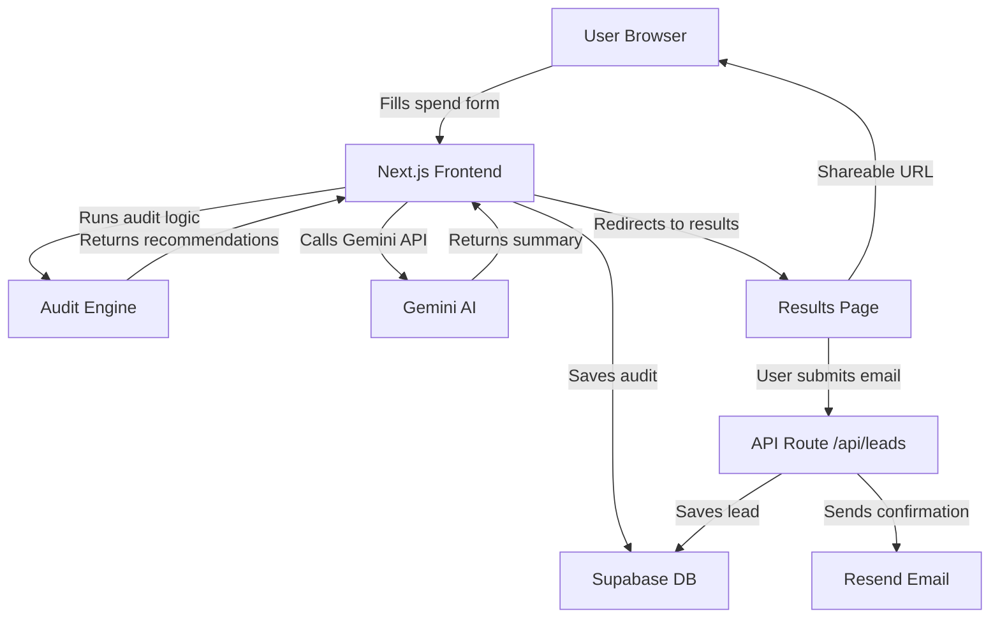

# Architecture

## System Diagram

## Data Flow

1. User fills in the spend form on the homepage
2. On submit, the audit engine runs client-side with hardcoded rules
3. Gemini API is called to generate a personalized 100-word summary
4. The audit result is saved to Supabase with a unique nanoid share ID
5. User is redirected to `/audit/[shareId]` results page
6. Results page loads from localStorage first, falls back to Supabase
7. User optionally submits email — saved to leads table, confirmation sent via Resend

## Why This Stack

- **Next.js** — Full-stack in one repo. API routes handle backend logic without a separate server.
- **TypeScript** — Type safety catches bugs early. Required by the assignment.
- **Tailwind CSS** — Utility-first styling. Fast to build, easy to maintain.
- **shadcn/ui** — Accessible, unstyled components. No bloated UI library.
- **Supabase** — Postgres database with a great free tier and simple SDK.
- **Gemini API** — Free tier available. Used only for the AI summary feature.
- **Resend** — Simple transactional email API with great developer experience.
- **Vercel** — Zero-config deployment for Next.js. Auto-deploys on push to main.

## Scaling to 10k Audits/Day

- Move audit engine to a dedicated API route to offload from client
- Add Redis caching for audit results to reduce Supabase reads
- Use Supabase connection pooling (PgBouncer) for high DB load
- Add a queue (BullMQ or Inngest) for email sending to avoid rate limits
- Use Vercel Edge Functions for the audit API for lower latency globally
- Add a CDN layer for the results pages since they are mostly static