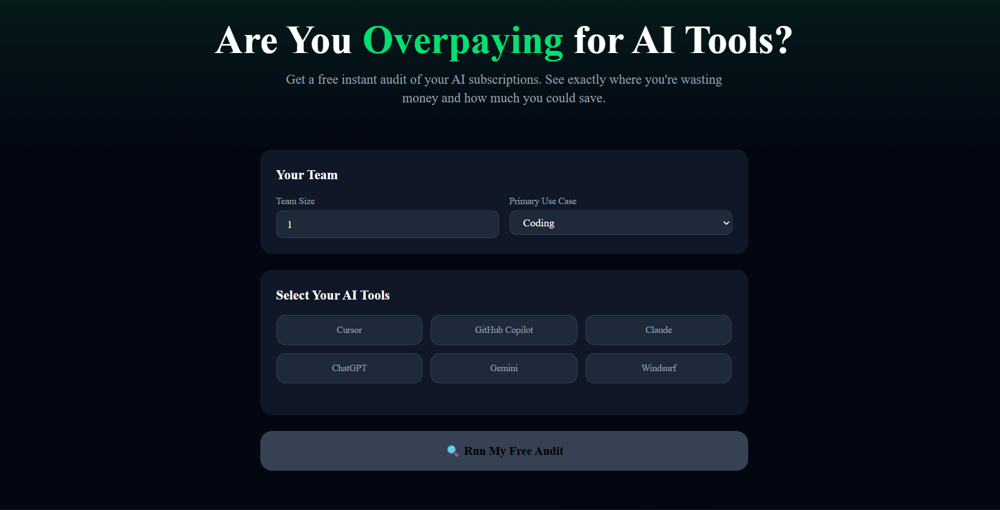

# AI Spend Audit

A free web app that audits your AI tool subscriptions and tells you exactly where you're overspending — and how much you could save.

Built as a lead-generation tool for [Credex](https://credex.rocks), which sells discounted AI infrastructure credits.

## Screenshots




## Live URL

[https://ai-spend-audit-six-kappa.vercel.app](https://ai-spend-audit-six-kappa.vercel.app)

## Quick Start

### Install
```bash
git clone https://github.com/Pavan251985/AI-spend-audit.git
cd ai-spend-audit
npm install
```

### Run locally
```bash
npm run dev
```

### Environment Variables
Create a `.env.local` file with:
### Deploy
Push to GitHub — Vercel auto-deploys on every push to main.

## Decisions

1. **Next.js over plain React** — Needed both frontend and API routes in one project. Next.js App Router handles this cleanly without a separate backend server.

2. **Hardcoded rules for audit engine instead of AI** — The audit math needs to be deterministic and defensible. A finance person should read the reasoning and agree. AI-generated recommendations would be unpredictable and hard to verify.

3. **Gemini API over Anthropic** — Anthropic requires a paid account to get API keys. Gemini has a free tier which makes the project accessible without upfront cost.

4. **Supabase over Firebase** — Supabase is Postgres-based which is more familiar, has a better free tier, and the SQL editor made it easy to set up tables quickly.

5. **Email capture after results, not before** — The assignment explicitly required this. Showing value first builds trust. Capturing email before showing results would reduce conversion and feel like a bait-and-switch.